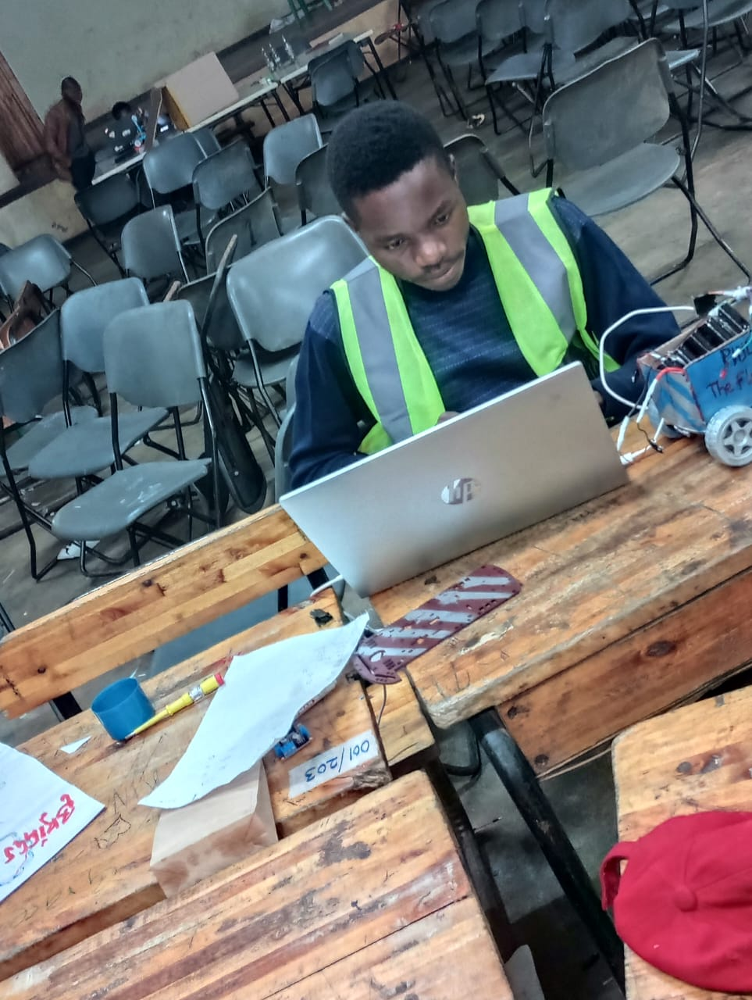

# Asset Path Migration Guide

## Overview
This guide shows how to update image paths from the old flat structure to the new organized assets structure.

## Path Updates Required

### Profile Images

#### Before
```html

```

#### After
```html

```

**File:** `index.html` (About section)

---

### Gallery Thumbnail Images

#### Before
```html
<!-- Graphic Design thumbnail -->


<!-- Smart Bin thumbnail -->


<!-- Photography thumbnail -->


<!-- Rescue Robot thumbnail -->


<!-- STEM Workshop thumbnail -->

```

#### After
```html
<!-- Graphic Design thumbnail -->


<!-- Smart Bin thumbnail -->


<!-- Photography thumbnail -->


<!-- Rescue Robot thumbnail -->


<!-- STEM Workshop thumbnail -->

```

**File:** `index.html` (Projects section)

---

### Smart Bin Project Images

#### Before
```html
<!-- In smartBin.html gallery -->


```

#### After
```html
<!-- In smartBin.html gallery -->


```

**File:** `smartBin.html` (Gallery section)

---

### Smart Bin Video

#### Before
```html
<video autoplay muted loop id="smartbinVideo">
  <source src="SmartBin/smartBinVedio.mp4" type="video/mp4">
  Your browser does not support the video tag.
</video>
```

#### After
```html
<video autoplay muted loop id="smartbinVideo">
  <source src="assets/videos/projects/smartbin/smartBinVedio.mp4" type="video/mp4">
  Your browser does not support the video tag.
</video>
```

**File:** `smartBin.html` (Video section)

---

### Graphic Design Images

#### Before
```html
<!-- In graphicDesigning.html -->


<!-- ... more images ... -->

```

#### After
```html
<!-- In graphicDesigning.html -->


<!-- ... more images ... -->

```

**File:** `graphicDesigning.html` (Gallery section)

---

### Resume/CV Download

#### Before
```html
<a href="Aston_Andrea_CV.pdf" class="btn" download>Download Resume (PDF)</a>
```

#### After
```html
<a href="assets/documents/Aston_Andrea_CV.pdf" class="btn" download>Download Resume (PDF)</a>
```

**File:** `index.html` (Resume section)

---

## Files to Update

### 1. **index.html** - 5 locations
- [ ] Profile image (About section)
- [ ] Graphics gallery thumbnail (Projects)
- [ ] Smart Bin gallery thumbnail (Projects)
- [ ] Photography gallery thumbnail (Projects)
- [ ] Rescue Robot gallery thumbnail (Projects)
- [ ] Robotics Instructor gallery thumbnail (Projects)
- [ ] Resume download link (Resume section)

### 2. **smartBin.html** - 2 locations
- [ ] Video source path (Video section)
- [ ] Gallery images (Gallery section) - 5 images

### 3. **graphicDesigning.html** - 1 location
- [ ] Gallery images (Gallery section) - 26 images

### 4. **comingOutSoon.html** - No changes needed

---

## Find & Replace Commands

### Using VS Code

#### Smart Bin Images
Find: `SmartBin/`
Replace: `assets/images/projects/smartbin/`

#### Graphics Images
Find: `GraphicDesigningImages/`
Replace: `assets/images/projects/graphics/`

#### Root-level Images
Find: `src="(Graphics|smartBin|Photography|RescueRobot|Robotics|AndreaAston)\.jpg"`
Replace: `src="assets/images/[category]/$1.jpg"`

#### CV
Find: `Aston_Andrea_CV.pdf`
Replace: `assets/documents/Aston_Andrea_CV.pdf`

---

## Step-by-Step Migration

### Phase 1: Update index.html
1. Open `index.html`
2. Find profile image: `AndreaAston.jpg`
3. Replace with: `assets/images/portfolio/AndreaAston.jpg`
4. Find gallery thumbnails (use Find & Replace)
5. Replace paths for Graphics, smartBin, Photography, RescueRobot, Robotics
6. Update resume download link

### Phase 2: Update smartBin.html
1. Open `smartBin.html`
2. Update video source path
3. Update all gallery image paths

### Phase 3: Update graphicDesigning.html
1. Open `graphicDesigning.html`
2. Update all 26 gallery image paths

### Phase 4: Verify All Links
1. Test all pages in browser
2. Verify images load correctly
3. Check console for 404 errors
4. Test on mobile devices
5. Test all gallery functionality

---

## Verification Checklist

After updating paths, verify:

### Visual Verification
- [ ] Profile photo loads in About section
- [ ] All project thumbnails visible on homepage
- [ ] Smart Bin images display in gallery
- [ ] Smart Bin video plays properly
- [ ] Graphics designs show in gallery
- [ ] All images responsive on mobile
- [ ] No broken image placeholders

### Functional Verification
- [ ] Like buttons work on all galleries
- [ ] Download CV link works
- [ ] Video controls responsive
- [ ] Lazy loading works (if implemented)
- [ ] Gallery filters work
- [ ] Smooth scrolling functions

### Console Verification
- [ ] No 404 errors in console
- [ ] No broken link warnings
- [ ] No CORS errors
- [ ] All assets load successfully

### Browser Testing
- [ ] Chrome (Windows/Mac/Linux)
- [ ] Firefox (Windows/Mac/Linux)
- [ ] Safari (Mac/iOS)
- [ ] Edge (Windows)
- [ ] Mobile Chrome (Android)
- [ ] Mobile Safari (iOS)

---

## Troubleshooting Common Issues

### 404 Errors
**Problem:** Images not found
**Solution:**
- Check path spelling exactly
- Verify file exists in correct folder
- Check file extension case sensitivity
- Use relative paths from HTML location

### Images Not Loading
**Problem:** Images display broken icon
**Solution:**
- Refresh browser (clear cache)
- Check browser console for errors
- Verify CORS headers if applicable
- Test locally vs on server

### Slow Image Loading
**Problem:** Images take too long to load
**Solution:**
- Compress images smaller
- Implement lazy loading
- Use WebP format if supported
- Consider CDN for large files

### Gallery Still References Old Paths
**Problem:** Some old paths remain
**Solution:**
- Search for old folder names
- Check nested directories
- Use Find in Files feature
- Look for hardcoded paths in JS

---

## After Migration

### Clean Up Old Folders
Once all paths are updated and verified:

1. Keep originals as backup temporarily
2. Remove old folders:
   - `SmartBin/` (images already in new location)
   - `GraphicDesigningImages/` (images already in new location)
   - Root directory images (already moved)

3. Keep only:
   - `assets/` (new organized structure)
   - All HTML files with updated paths
   - `css/` and `js/` folders
   - Documentation files

### Update Git
```bash
git add .
git commit -m "Migrate assets to organized assets structure"
git push origin main
```

### Update Documentation
- [ ] Update any README references
- [ ] Update API documentation if applicable
- [ ] Update team wiki/docs
- [ ] Update deployment guide

---

## Benefits After Migration

✅ **Organized Structure**
- Clear asset hierarchy
- Easy to locate files
- Professional layout

✅ **Scalability**
- Room for new projects
- Easy to add assets
- Consistent naming

✅ **Maintainability**
- Simple to update
- Clear documentation
- Reduced clutter

✅ **Performance**
- Easier to optimize
- Cache-friendly structure
- CDN-ready paths

---

## Reference Sheet

| Old Path | New Path |
|----------|----------|
| `AndreaAston.jpg` | `assets/images/portfolio/AndreaAston.jpg` |
| `Graphics.jpg` | `assets/images/gallery/Graphics.jpg` |
| `smartBin.jpg` | `assets/images/gallery/smartBin.jpg` |
| `Photography.jpg` | `assets/images/gallery/Photography.jpg` |
| `RescueRobot.jpg` | `assets/images/gallery/RescueRobot.jpg` |
| `Robotics Instructor.jpg` | `assets/images/gallery/Robotics Instructor.jpg` |
| `SmartBin/smartBin1.jpg` | `assets/images/projects/smartbin/smartBin1.jpg` |
| `SmartBin/smartBinVedio.mp4` | `assets/videos/projects/smartbin/smartBinVedio.mp4` |
| `GraphicDesigningImages/image*.jpg` | `assets/images/projects/graphics/image*.jpg` |
| `Aston_Andrea_CV.pdf` | `assets/documents/Aston_Andrea_CV.pdf` |

---

**Status:** Ready for migration
**Estimated Time:** 30-45 minutes
**Difficulty:** Easy
**Impact:** High (better organization)

---

**Last Updated:** November 14, 2025
